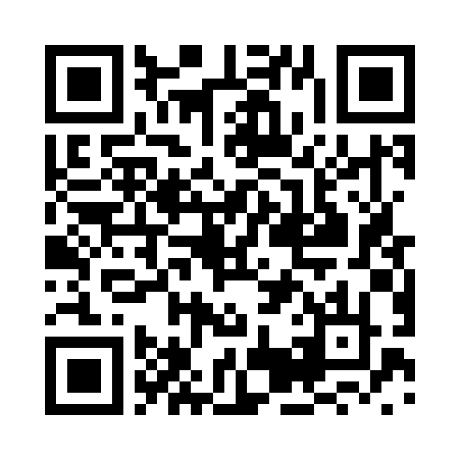

#Brookdale Covenant - Bible Experience Podcast

This a podcast feed to listen to the .mp3 recoordings created the Community Bible Experince. 
The feed follows the schedule set by [Brookdale Covenant](http://brookdalecovenant.org/) in regards to the [Covenant Church - Community Bible Experience](http://cbe.covchurch.org/) Bible reading program.

This podcast feed is voluntarly hosted by Dwight Gappa as for a way to help the community at Brookdale Covenant Church.

Feel free to contact Dwight Gappa with feedback through this [contact form](./contact.php) or open an issue on Github project page <a href="https://github.com/gunther3613/bd_cov_cbe_podcast">https://github.com/gunther3613/bd_cov_cbe_podcast</a>.

##Podcast feed URL

Copy the URl below into a podcast app to add the Podcast feed.

<a href="http://www.cgoutreach.net/brookdale_cbe/bd_cov_cbe_podcast.php">https://github.com/gunther3613/bd_cov_cbe_podcast</a>

Podcast Feed URL QRcode

##Helpful resources

CNET - Add any podcast to the iOS Podcasts app. <a href="https://www.cnet.com/how-to/add-any-podcast-to-the-ios-podcasts-app/">https://github.com/gunther3613/bd_cov_cbe_podcast</a>

DoggCatcher - the Android Podcatcher. I have been using this Podcast app for years on Android. <a href="http://www.doggcatcher.com/">https://github.com/gunther3613/bd_cov_cbe_podcast</a>

##copyright

The podcast feed .php was created by Dwight Gappa and Copyright 2016 Dwight Gappa

All the material related to the *Books of the Bible* and the *[Community Bible Experience][cbe]* are **created by [Biblica]** and are **copyright [Biblica]**.

[cbe]:http://www.biblica.com/en-us/cbe/

[Biblica]:http://www.biblica.com/